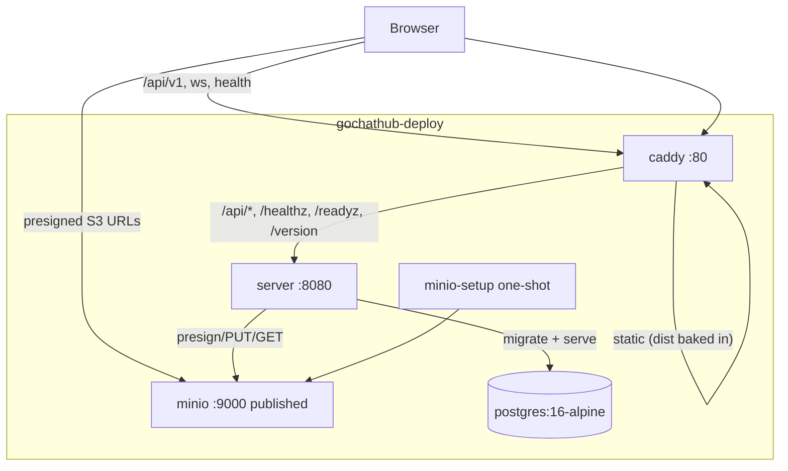

# goChatHub Installer — Design

Implements REQUIREMENTS.md. Targets upstream SHAs pinned in `pins.env`; no upstream changes.

## 1. Design drivers (from server code, verified)

- All REST under `/api/v1/…`; WS at `GET /api/v1/ws`; health at `/healthz`, `/readyz`, `/version` (unprefixed) — Caddy matcher must cover both prefixes.
- Attachment upload/download = presigned S3 URLs (minio-go `PresignPut`/`PresignGet`), **host-signed**. The presigned URL's host must equal the browser-visible host. Server runs against `http://minio:9000` internally, so that host would leak into browser URLs and fail. Consequence: **publish MinIO on a second port** and set `S3_ENDPOINT=http://<PUBLIC_HOST>:9000`. This is the one deviation from "one port" in the requirements; unavoidable without a server-side proxy code change.
- Migrations are rerunnable; explicit `migrate` before `serve`, re-run on each start.
- Single origin (ADR-016): browser only ever talks to Caddy; `ORIGIN=http://<PUBLIC_HOST>`, `COOKIE_SECURE=false` (plain HTTP by explicit user decision).

## 2. Repo layout (this installer repo)

```
gochatinstaller/
├── install.sh              # build + bootstrap engine (idempotent)
├── docker-compose.yml      # template; compose only orchestrates prebuilt images
├── Caddyfile               # baked into the caddy image at build time
├── .dockerignore           # generated into the deploy dir (build context = deploy dir)
├── pins.env                # GOCHATHUB_SERVER_SHA / GOCHATHUB_WEBUI_SHA
├── docker/
│   ├── caddy.Dockerfile    # stage1: bun build webui → dist; stage2: caddy + dist + Caddyfile
│   └── server.Dockerfile   # multi-stage Go build of cmd/chatserver
├── README.md
├── REQUIREMENTS.md
├── CLAUDE.md
└── docs/
    └── DESIGN.md           # this file
```

Deploy dir created by installer (`gochathub-deploy/` default, first CLI arg):

```
gochathub-deploy/
├── docker-compose.yml      # copied template
├── .env                    # generated (gitignored)
├── Makefile                # generated from template
├── ghc                     # generated: CLI wrapper into the server container
├── clones/                 # git clones of both upstreams, checked out at pins
└── backups/                # created by `make backup`
```

## 3. Container topology



- `caddy` — image `gochathub/caddy` (webui `dist/` **baked in** + Caddyfile). Only long-running edge; sole published port except MinIO. No separate webui container — fewer hops, and SPA fallback lives with the asset server.
- `server` — image `gochathub/server`; `command: sh -c "gochathub-server migrate && exec gochathub-server serve"`.
- `postgres` — `postgres:16-alpine`, healthcheck `pg_isready`.
- `minio` — `minio/minio`, `server /data`; healthcheck `/minio/health/ready`.
- `minio-setup` — `minio/mc` one-shot: wait ready → `mc mb --ignore-existing` bucket → exit 0. `restart: "no"`.

Internal network only; published: `${PUBLISHED_PORT}:80` (caddy), `${MINIO_PUBLISHED_PORT}:9000` (minio). MinIO console (9001) not published.

## 4. Caddyfile (baked into `gochathub/caddy`)

```caddy
:80 {
	@edge path /api/* /healthz /readyz /version
	handle @edge {
		reverse_proxy server:8080
	}
	handle {
		try_files {path} /index.html
		file_server
	}
}
```

- `handle` blocks: no directive-order ambiguity. `/api/*` includes `GET /api/v1/ws`; Caddy reverse_proxy upgrades WebSockets transparently.
- SPA fallback for vue-router history mode; `try_files` before `file_server`.
- No TLS, no `tls` directive, no ACME, per explicit requirement.

## 5. docker-compose.yml

Authoritative file: [`docker-compose.yml`](../docker-compose.yml) in the repo root (copied into the deploy dir verbatim every install). Deltas vs the skeleton first drafted here, all forced by reality:

- **MinIO images gone from registries** (Sep 2026 — community edition archived, deleted from Docker Hub, quay now 401s): containers use `cgr.dev/chainguard/minio` (maintained fork, same S3 API and presigns — verified live) and `cgr.dev/chainguard/minio-client` for the bucket bootstrap. The client one-shot uses the documented `MC_HOST_local` env alias, so no shell-free entrypoint gymnastics; Chainguard images ship `bash` but no `curl`/`wget`, so the MinIO healthcheck is a bash `/dev/tcp/127.0.0.1/9000` probe.
- **Presign host resolution**: `S3_ENDPOINT=http://${MINIO_PUBLIC_HOST}:${MINIO_PUBLISHED_PORT}`, `MINIO_PUBLIC_HOST` = host part of `PUBLIC_HOST` (derived at install time). When that host is `localhost`, the server service gets `extra_hosts: ["localhost:host-gateway"]` so the server's boot-time bucket check reaches the published (docker-proxy) port, while the presigned URL still reads `localhost:19000` to the browser. LAN-IP hosts need no entry.
- **No ENTRYPOINT in the server image** — cobra would see `sh` as an unknown subcommand when compose passes the serve wrapper as `command`. Compose passes full argv; `ghc` runs `gochathub-server "$@"`.
- `LISTEN_ADDR` (default `:8080`), `MAX_UPLOAD_BYTES` (server default), `S3_REGION` (minio default `us-east-1`) are server/image defaults — not knobs.
- Volumes: `pgdata`, `miniodata`. Everything else internal-network only; published: `${PUBLISHED_PORT}:80` and `${MINIO_PUBLISHED_PORT}:9000` (console 9001 stays internal).

## 6. Generated `.env`

| Key | Source |
|---|---|
| `PUBLISHED_PORT` | prompted, default `8080` (`--port` flag) |
| `MINIO_PUBLISHED_PORT` | prompted, default `9000` (`--minio-port` flag) |
| `PUBLIC_HOST` | prompted with default `localhost:<PUBLISHED_PORT>`; LAN deployments set `host:port` reachable from browsers. Drives `ORIGIN`; its host part drives `S3_ENDPOINT` |
| `MINIO_PUBLIC_HOST` | derived (host part of `PUBLIC_HOST`), not a user knob. IPv6-literal hosts unsupported — use a resolvable IPv4/DNS host |
| `POSTGRES_USER` / `POSTGRES_DB` | `chat` |
| `POSTGRES_PASSWORD`, `MINIO_ROOT_PASSWORD` | random 32 hex, generated once (kept on re-run) |
| `MINIO_ROOT_USER` | `gochathub` |
| `S3_BUCKET` | `gochathub` |

`ORIGIN` and `S3_ENDPOINT` derived from `PUBLIC_HOST` by compose interpolation — single knob for hostname changes.

## 7. Dockerfiles

**`docker/caddy.Dockerfile`** (build context = the deploy dir — `.dockerignore` whitelists `clones/**` + `Caddyfile` only):

```dockerfile
# stage 1 — build webui
FROM oven/bun:1 AS webui
WORKDIR /src
COPY clones/gochathub-webui/ ./
RUN bun install && bun run build

# stage 2 — serve it
FROM caddy:2
COPY Caddyfile /etc/caddy/Caddyfile
COPY --from=webui /src/dist /srv
```

**`docker/server.Dockerfile`** (build context = `clones/gochathub-server`; golang 1.26 — go.mod requires it):

```dockerfile
FROM golang:1.26 AS build
WORKDIR /src
COPY go.mod go.sum ./
RUN go mod download
COPY . .
RUN CGO_ENABLED=0 go build -o /out/gochathub-server ./cmd/chatserver

FROM alpine:3
# no ENTRYPOINT: compose passes full argv (sh -c migrate&&serve), ghc passes subcommands
COPY --from=build /out/gochathub-server /usr/local/bin/gochathub-server
```

Tag both `gochathub/{caddy,server}:local`. Builds are run by `install.sh` (not `compose build`) because contexts differ; compose references prebuilt images only.

## 8. `install.sh` flow (idempotent steps, state per step)

1. Check prerequisites: `git`, `docker`, `docker compose`, `ss` (collision probe). Missing → name it, exit 1.
2. Parse flags: `[target-dir] [--port N] [--minio-port N] [--public-host h:p] [--admin NAME] [--non-interactive] [--sha server=… --sha webui=…]`. Explicit port flags are **strict** (see step 3b): if taken, fail fast naming the conflict (`exit 1`) — no auto-shift for requested values.
3. Load target `.env` if it exists (reuse all generated values; never regenerate passwords). Otherwise generate + write.
3b. Port collision resolution (FR-5): for each of the two published ports not arriving from an existing `.env` or an explicit flag — probe `ss -ltn` (v4+v6; docker-proxy shows up here too) — preferred busy → `+1` scan up to +20, first free wins, chosen values written to `.env` and reported in the final summary. Re-runs: exclude ports this deployment itself already publishes (`docker compose ps` in the target dir) from the candidate check. Both candidates exhausted → `exit 1` with `--port`/`--minio-port` guidance. If `PUBLIC_HOST` was defaulted and the edge port shifted, recompute its default (`localhost:<new>`); an explicitly passed `--public-host` is never rewritten (mismatch warning printed instead).
4. Sync clones: clone if absent (public https URLs), then `git fetch` + `git checkout <pin>`. SHA override flag updates the checkout (and optionally pins.env with `--bump-pins`).
5. Build both images (`docker build` above). Unchanged inputs rebuild in seconds via the docker layer cache — no skip logic, no pin labels.
6. Copy `docker-compose.yml` template into target (overwrite every run — file is derived, no user edits).
7. `docker compose up -d` → wait `GET /healthz` (from inside the server container via compose DNS name — `wget http://server:8080/healthz`, 120s budget; dump recent server logs on failure).
8. Admin bootstrap: interactive prompt for name/display-name/password unless `--admin NAME` + password via env `ADMIN_PASSWORD` (or `-p` file). Skipped when an admin-role user already exists (`gochathub-server user list` filtered by role).
9. Print summary: URL, published ports, admin name, where data lives.

`--non-interactive` requires all prompted values present as flags/env; otherwise error listing what's missing (scriptable/CI deploys per requirements).

## 9. Makefile (generated into deploy dir)

`INSTALLER_DIR` baked at generation so targets call `$(INSTALLER_DIR)/install.sh <target> --non-interactive` for work that needs the install logic:

- `install` — full install (first run or repair).
- `update` — rerun install (re-sync pins, rebuild — layer-cached, `compose up -d`; migrate re-runs on start). Never touches volumes.
- `bump-pins` — fetch `main` heads of both repos, write new SHAs into `$(INSTALLER_DIR)/pins.env`, then run `update`. Explicit, manual, per requirements.
- `logs` — `docker compose logs -f [svc…]`.
- `status` — `docker compose ps`.
- `backup` — timestamped `pg_dump | gzip` into `backups/`. MinIO object volume copy documented in README (tar the named volume), run on demand rather than every backup.
- `restart` / `up` / `down` — compose lifecycle.
deploy dir gets a `ghc` wrapper (3-line sh):
```sh
#!/bin/sh
exec docker compose -f "$(dirname "$0")/docker-compose.yml" run --rm server gochathub-server "$@"
```
`run --rm` over `exec`: works with server container stopped; compose env supplies `DATABASE_URL`. Makefile alias: `cli` → `./ghc $(ARGS)`.

- `uninstall` — `compose down`; only `-v` with explicit confirmation.

## 10. Pin mechanics

`pins.env` holds the SHAs; `install.sh` sources it before flag overrides. A compatible pair matters (webui's `api/openapi.yaml` snapshot must match the server at its SHA) — bump both together via `make bump-pins`.

## 11. Risks / notes

- **Presigned URLs are host-bound** → MinIO must be browser-reachable at `$PUBLIC_HOST:$MINIO_PUBLISHED_PORT`. If the machine is behind NAT without forwarded ports, attachments break while chat still works. Documented in README.
- Plain HTTP (user decision). Cookies unencrypted on the wire; acceptable for LAN/self-hosted deployments, documented as the user's choice.
- `TRUST_PROXY=true` only because Caddy forwards; the server must never be exposed without it.
- Server container restarts re-apply migrations (rerunnable by design).
- `VAPID` keys auto-generate on first boot and persist in DB. `PUSH_*` left unset (ntfy out of scope).
- `minio-setup` is the only one-shot service; keep it `restart: "no"`.

## 11b. Port collision handling (FR-5 design detail)

- Probe: `ss -ltn` parse both v4 and v6 listen lines; `docker-proxy` listeners included, so a busy Docker port reads as busy even when `docker ps` would show nothing for the current target. `ss` missing → fail at prerequisites (step 1) naming it; one tool, one code path.
- Strict precedence: existing `.env` value == explicit flag == strict. Only freshly-generated values auto-shift. Consequence: first install with defaults shifts freely; every later `make install` keeps the shifted `.env` values unless the user edits them deliberately.
- Own-port exclusion on re-run computed from `docker compose ps --format json` in the target dir (published ports of this project only), never from a network-wide docker scan.

## 11a. Resolved design questions (decided)

- **2nd published port for MinIO** → accepted. `S3_ENDPOINT=http://$PUBLIC_HOST:$MINIO_PUBLISHED_PORT`; only deviation from the one-port shape, forced by host-signed presigned URLs.
- **ntfy push wiring** → strictly later. Generated `.env` leaves `PUSH_*` unset; README documents manual wiring for a future `--ntfy HOST` option. Browser Web Push works out of the box (VAPID auto-generated).

## 12. Acceptance-criteria mapping

| AC | Covered by |
|---|---|
| AC-1 fresh install → URL + admin | §8 install.sh steps 1–9 |
| AC-2 live messaging via WS | §4 Caddyfile `/api/*` proxy incl. `GET /api/v1/ws` |
| AC-3 attachments + avatars | §3 published MinIO, §5 `ALLOW_UPLOADS`+`S3_*`, §6 bucket bootstrap |
| AC-4 idempotent re-run | §8 step 3/5 (reuse .env, image-pin skip), no destructive steps |
| AC-5 update preserves data | §9 `update` (no volume ops, migrate rerunnable) |
| AC-6 backup/restore round-trip | §9 `backup`/`restore-backup` |
| AC-7 missing prerequisite fail-fast | §8 step 1 |
| AC-8 port collision auto-shift / strict flags | §8 step 3b, §11b |